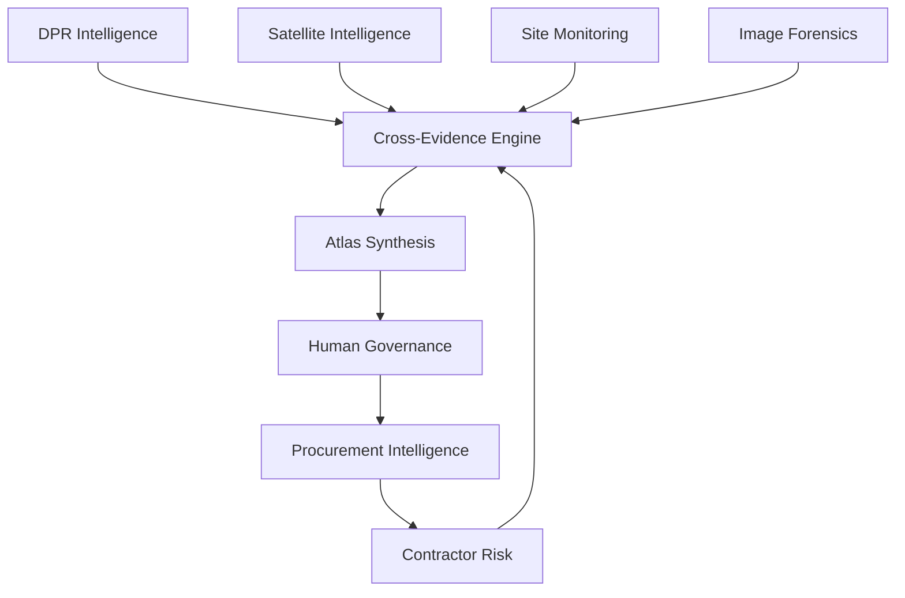

# ATLAS ASSURANCE

## Autonomous Assurance for Physical Infrastructure

Atlas Assurance continuously verifies whether public infrastructure projects match what was promised, what is observed, and what should be procured next.

By combining document intelligence, satellite evidence, field monitoring, image forensics, contractor reliability, and human governance, Atlas creates a closed-loop assurance system for infrastructure delivery.

> **Atlas detects. Atlas explains. Humans decide. Procurement learns.**

---

## Why Atlas Assurance?

Public infrastructure oversight is fragmented.

Detailed Project Reports (DPRs), satellite observations, contractor histories, field inspections, and procurement systems operate in silos. Signals that should reinforce one another rarely converge.

As a result:

* Reported progress may diverge from reality.
* Fraud indicators surface too late.
* Unsafe practices remain undetected.
* Human reviewers lack context across evidence sources.
* Contractors associated with repeated failures continue to participate without consequence.

The challenge is not the absence of data.

The challenge is the absence of assurance.

---

## Our Approach

Atlas Assurance establishes a continuous governance loop across the infrastructure lifecycle.

### Detect

Identify discrepancies across documents, imagery, inspections, and contractor records.

### Explain

Correlate signals and provide human-understandable rationales.

### Govern

Enable accountable human decision-making through structured review workflows.

### Prevent

Feed assurance outcomes back into procurement to reduce repeat failures.

```
Detection
    ↓
Accountability
    ↓
Prevention
```

---

## Core Capabilities

| Capability                  | Description                                                                                                               |
| --------------------------- | ------------------------------------------------------------------------------------------------------------------------- |
| DPR Baseline Intelligence   | Extracts project assumptions and detects 58 CAG-inspired violation categories using XGBoost and retrieval-based analysis. |
| Satellite Intelligence      | Compares reported execution against observed activity using Sentinel imagery and change detection.                        |
| Site Monitoring             | Verifies PPE compliance and field safety using computer vision.                                                           |
| Image Forensics             | Detects manipulated evidence submissions through Error Level Analysis.                                                    |
| Contractor Risk             | Maintains a National Contractor Reliability Index (NCRI) across projects.                                                 |
| Cross-Evidence Intelligence | Correlates findings across modules to identify corroborated concerns.                                                     |
| Atlas Synthesis             | Produces a unified, explainable assurance score with supporting rationale.                                                |
| Human Governance            | Supports approvals, overrides, and reinvestigation requests with a complete audit trail.                                  |
| Procurement Intelligence    | Uses assurance outcomes to influence contractor eligibility and future decisions.                                         |

---

## Governance Loop

Atlas Assurance transforms fragmented evidence into operational decisions.

1. DPRs establish the baseline.
2. Satellite observations verify reality.
3. Field and forensic evidence strengthen confidence.
4. Cross-evidence analysis identifies corroborated concerns.
5. Atlas synthesizes a unified assurance view.
6. Human reviewers make accountable decisions.
7. Procurement learns from outcomes.

---

## System Architecture



---

## Demo Projects

| Project ID | Project                           | Authority |
| ---------- | --------------------------------- | --------- |
| PRJ-NMA    | Navi Mumbai International Airport | CIDCO     |
| PRJ-DHL    | Dholera Smart City Phase 1        | DMIC-DC   |
| PRJ-DME    | Delhi–Mumbai Expressway Segment 4 | NHAI      |

---

## Technology Stack

### Frontend

* Next.js
* TypeScript
* CSS Design System

### Backend

* FastAPI
* Python
* JSON Digital Twin Persistence

### AI and Analytics

* XGBoost
* ChromaDB
* Retrieval-Augmented Generation (RAG)
* YOLOv8
* Error Level Analysis
* Satellite Change Detection
* Mistral (optional)

### Integrations

* Sentinel-2 imagery
* Twilio (optional)
* GSTIN verification services

---

## Typical Workflow

1. Select a project.
2. Upload a DPR.
3. Generate an Assurance Cycle.
4. Review evidence layers.
5. Investigate corroborated concerns.
6. Review Atlas Synthesis.
7. Execute governance actions.
8. Generate an Assurance Report.
9. Reflect outcomes into procurement decisions.

---

## Repository Structure

Documented to support reproducibility, extension, and evaluation.

* Backend services and orchestration
* Frontend dashboard
* Policy configurations
* Digital Twin persistence
* Procurement workflows
* Testing utilities

---

## Getting Started

### Backend

```bash
cd backend
pip install -r requirements.txt

python3 -m uvicorn main:app --host 127.0.0.1 --port 8000
```

### Frontend

```bash
cd infra-ai-app
npm install
npm run dev
```

Open:

```
http://localhost:3000
```

---

## Key API Categories

* Assurance generation
* Evidence retrieval
* Governance actions
* Procurement operations
* Reporting
* Project history reset

---

## Future Directions

* Live GIS integrations
* Government system interoperability
* Automated contractor watchlists
* Federated multi-agency deployments

---

## Contributors

Built by Team Atlas Intelligence for the FarAway Hackathon.

---

## Disclaimer

Atlas Assurance provides analytical recommendations derived from available evidence and configurable policy assumptions.

Final decisions remain under authorized human governance.
