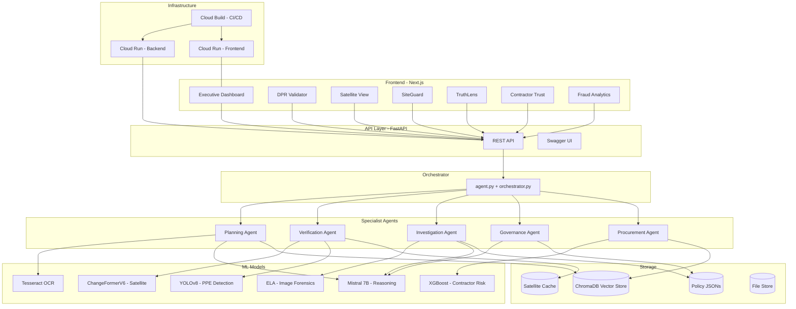

# Atlas Intelligence

**Autonomous Assurance for Physical Infrastructure**  
FAR AWAY 2026 — Agentic & Autonomous Systems

---

## Live Deployments

| Service | URL |
|---|---|
| Frontend | https://infra-ai-frontend-5fvzoiirja-ew.a.run.app |
| Backend API | https://infra-ai-governance-mvp-5fvzoiirja-ew.a.run.app |
| API Docs | https://infra-ai-governance-mvp-5fvzoiirja-ew.a.run.app/docs |

---

## What This Is

Infrastructure projects generate massive volumes of evidence — DPRs, budgets, satellite imagery, site photos, contractor records, compliance reports. These streams are reviewed in silos, manually, and long after problems have already developed.

Atlas Intelligence connects these streams. It ingests project intent (the DPR), tracks how reality evolves during execution, and surfaces discrepancies before they become failures. Oversight shifts from periodic audits to continuous assurance.

The core principle: **Atlas recommends. Humans decide.** The system highlights risks and generates investigation outputs, but every consequential action requires a human approval.

---

## The Problem

Current infrastructure oversight has four structural gaps:

1. **Delayed visibility** — Audits happen periodically. By the time issues are found, corrective action is expensive.
2. **Fragmented evidence** — Plans, satellite data, site photos, contractor history, and inspection reports are never correlated.
3. **Static expectations** — DPRs are written at project initiation but executed over years. Inflation, cost escalation, and regulatory changes are never factored into subsequent reviews.
4. **Cognitive overload** — Auditors manually process thousands of pages of documentation while simultaneously identifying anomalies and assessing severity.

---

## System Design

### High-Level Architecture




---

## What We Built

### Backend (FastAPI + Python)

| Module | File | What it does |
|---|---|---|
| DPR Intelligence (DeepScan) | `dpr_extractor.py`, `rag_engine.py` | OCR, budget/timeline extraction, RAG over uploaded DPRs |
| Project Digital Twin | `digital_twin.py` | Persists structured project baseline from DPR |
| Context Adjustment | `context_adjustment.py` | Adjusts expectations for inflation, time elapsed |
| Satellite Assurance (OrbitVerify) | `satellite.py`, `change_detector_ml.py` | ChangeFormerV6-based progress verification from satellite imagery |
| Safety Assurance (SiteGuard) | `main.py` (vision endpoints) | YOLOv8-based PPE detection and worker compliance on site photos |
| Evidence Integrity (TruthLens) | `forensics.py` | Error Level Analysis (ELA) for image tampering detection |
| Procurement Assurance (ProcureSense) | `ncri_engine.py`, `bidding_engine.py` | XGBoost-based contractor risk scoring (NCRI), GSTIN verification |
| Cross-Evidence Investigation | `investigation_engine.py`, `cross_evidence.py` | Correlates satellite + DPR + safety findings into a narrative |
| Governance & Recommendations | `governance.py`, `policy_loader.py` | Risk classification, recommended actions, escalation pathways |
| Report Generation | `report_generator.py` | PDF assurance reports with findings and audit trail |
| Orchestrator | `orchestrator.py`, `agent.py` | Coordinates the agent workflow across modules |

58-feature constraint matrix used in the DPR audit engine. Policies stored in `/policies/` as JSON (risk weights, severity definitions, cross-evidence rules, NCRI scoring).

### Frontend (Next.js + TypeScript)

| Component | What it does |
|---|---|
| `ProjectsRail` | Lists registered projects, status overview |
| `DPRValidator` | Upload and validate DPR documents, view extracted baseline |
| `SatelliteView` | Visual diff of satellite imagery, progress discrepancy estimate |
| `SiteGuard` | Upload site photos, view PPE detection and safety compliance |
| `TruthLens` | Upload images for ELA-based tampering analysis |
| `ContractorTrust` | Contractor NCRI scorecard and procurement risk view |
| `FraudAnalytics` | Cross-evidence risk aggregation and finding summaries |
| `TenderRegistry` | Browse live tender data |

---

## Tech Stack

**Backend**
- FastAPI, Python
- YOLOv8 (PPE detection)
- ChangeFormerV6 (satellite change detection)
- XGBoost (contractor risk scoring)
- Tesseract OCR (document intelligence)
- ChromaDB + RAG (DPR retrieval)
- Mistral 7B (reasoning and narrative generation)
- Error Level Analysis (image forensics)

**Frontend**
- Next.js 15, TypeScript, Tailwind CSS

**Infrastructure**
- Google Cloud Run (backend + frontend)
- Google Cloud Build (CI/CD)
- Docker

---

## Running Locally

### Backend

```bash
cd backend
python -m venv venv && source venv/bin/activate
pip install -r requirements.txt
uvicorn main:app --reload --port 8000
```

### Frontend

```bash
cd infra-ai-app
npm install
NEXT_PUBLIC_API_BASE=http://localhost:8000 npm run dev
```

---

## API Reference

Full interactive docs: `https://infra-ai-governance-mvp-5fvzoiirja-ew.a.run.app/docs`

| Endpoint | Method | Description |
|---|---|---|
| `/health` | GET | System health and module status |
| `/projects` | GET | List registered projects |
| `/projects/{id}/dpr` | POST | Upload and process DPR |
| `/projects/{id}/satellite` | GET | Satellite assurance results |
| `/vision/analyze` | POST | Site safety photo analysis (YOLOv8) |
| `/forensics/ela` | POST | Image tampering analysis |
| `/ncri/{contractor_id}` | GET | Contractor risk score |
| `/projects/{id}/investigate` | POST | Trigger cross-evidence investigation |
| `/projects/{id}/report` | GET | Generate PDF assurance report |

---

## Team — Strawhats

- Sumit Das — [@Sumit-ai-dev](https://github.com/Sumit-ai-dev)
- Sakshi Kasat — [@SakshiKasat18](https://github.com/SakshiKasat18)
- Abhay Anand — [@abhayDoes](https://github.com/abhayDoes)
